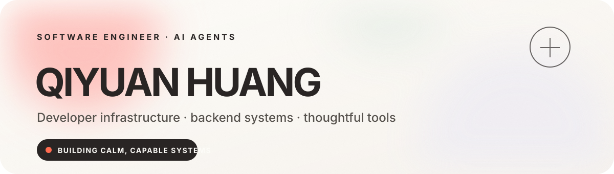

  

  
  

## Hey, I’m Qiyuan.

I’m a software engineer focused on **reliable AI agents, developer infrastructure, and backend systems**. I like turning complex execution into calm interfaces: explicit boundaries, useful traces, recoverable workflows, and evaluations that reflect real decisions.

- Building human-in-the-loop agents and practical MCP tools
- Exploring persistent memory, hybrid retrieval, and eval-driven development
- Designing long-running systems that remain understandable under pressure
- See the full story at **[qhuang258.github.io](https://qhuang258.github.io/)**

## Experience · Vidu AI

### Software Engineering Intern, AI Agents

`ShengShu Technology · June–August 2026`

- Led **LarkCC**, an internal agent platform, from requirements and architecture through deployment and iteration for company-wide engineering and operations workflows.
- Delivered **17 MCP tools** with the team and directly implemented **4 compute-operations tools**.
- Built role-scoped access, human approvals, cancellation, scheduling, provider failover, token-budget compaction, and hybrid **BM25 + embedding** memory retrieval.
- Led architecture and deployment for **ss-chord**, an AI development workbench spanning browser agents, developer tools, and language services.
- Made long-running work resumable with persistent event traces, isolated Git worktrees, parallel evidence gathering, and independent review of diffs and tests.

## Selected work

| Project | Focus | What it explores |
|---|---|---|
| **[AutoApply Agent](https://github.com/qhuang258/job-helper)** | AI agents · RAG · safety | Human-in-the-loop assistance with grounded claim checks and a hard no-submit boundary. |
| **[TranquilFocus](https://github.com/qhuang258/tranquilfocus-web)** | Local-first · creative coding | A privacy-first focus tracker that turns interaction rhythm into a quiet visual experience. |
| **[SocialAI](https://github.com/qhuang258/socialai)** | Go · backend systems | A layered service with Elasticsearch and Google Cloud Storage integration. |
| **[Zero Game](https://github.com/qhuang258/zero-game)** | JavaScript · frontend | A lightweight browser game built from scratch with HTML, CSS, and vanilla JavaScript. |

## Working stack

  
  
  
  
  
  
  
  

## Principles I keep returning to

> Autonomy becomes useful when the boundaries are explicit, the trace is readable, and a human can still say no.

> A long task should survive the interface that started it. Resumability is part of the product.

  Building calm, capable systems — one explicit boundary at a time.

